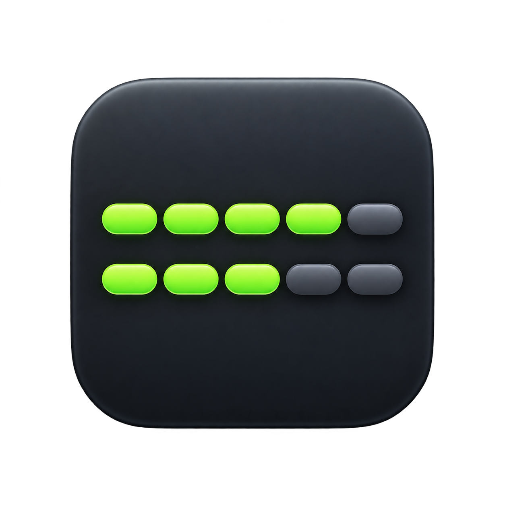
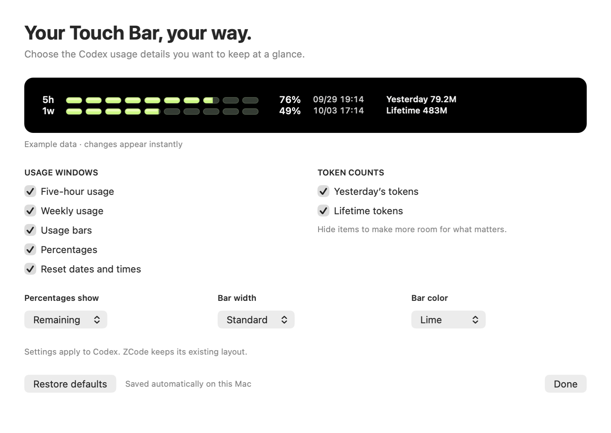

<div align="center">
  
  <h1>Codex Usage Bar</h1>
  <p>Customize the Codex usage information on your MacBook Pro Touch Bar.</p>
  <p>Five-hour and weekly limits, reset times, and token counts—right above your keyboard.</p>

[](LICENSE)
[](https://github.com/ne0guy/codex-touchbar-usage/releases/latest)
[](#requirements)
[](helper/CodexTouchBarHelper)

</div>

**Created originally by [Daytimeflow](https://github.com/Daytimeflow).** This is a fork of [Daytimeflow/codex-touchbar-usage](https://github.com/Daytimeflow/codex-touchbar-usage), maintained by [ne0guy](https://github.com/ne0guy). The original project provides the native Touch Bar helper and Codex usage foundation. This fork adds a customization window, a more compact layout, English presentation, and a new app icon. The original MIT copyright notice is retained in [LICENSE](LICENSE).

## What it does

Codex Usage Bar shows a native usage panel while Codex or its ChatGPT desktop shell is in the foreground. Switch to another app and the panel hides, restoring the system Touch Bar controls.

Version **0.4.1** restores live usage refresh and prevents duplicate helper copies. Version **0.4.0** adds a Mac settings window. Choose the details you want to see, preview your changes immediately, and save your preferences automatically.

<p align="center">
  
</p>

The screenshot uses example usage data. When available, the settings preview shows your latest usage snapshot.

## Features

| Feature | Options |
| --- | --- |
| Usage windows | Five-hour usage, weekly usage, or both |
| Display columns | Usage bars, percentages, reset dates and times |
| Token counts | Yesterday's tokens, lifetime tokens, or both |
| Usage mode | Remaining or used usage |
| Bar style | Standard or compact width; lime, sky blue, or amber |
| Layout | Hidden columns collapse; single rows are centered |
| Preferences | Saved on this Mac; restore the compact default layout with one click |
| Focus awareness | Appears while Codex is in the foreground; hides when you switch away |
| ZCode support | Separate GLM / OpenCode Go usage panel with tap-to-expand details |

Low remaining quota uses warning colors. Codex customization settings apply to the Codex panel; ZCode keeps its existing layout. See [ZCode usage](docs/zcode-usage.md) for provider setup and data definitions.

## Requirements

- A MacBook Pro with a Touch Bar, running macOS 12 or later.
- The prebuilt release and Homebrew cask require Apple Silicon.
- Codex installed and signed in locally, with Codex CLI credentials available in `~/.codex/auth.json` (or your configured Codex home).
- Source builds require Swift through Xcode or Command Line Tools. Prebuilt installations do not require Swift.

The helper uses private macOS system-modal Touch Bar APIs. This release is intended for direct installation, rather than the Mac App Store.

## Installation

### Homebrew

```bash
brew tap ne0guy/codex-usage-bar https://github.com/ne0guy/codex-touchbar-usage.git
brew install --cask ne0guy/codex-usage-bar/codex-usage-bar
```

The cask installs the app, registers its LaunchAgent, and starts it. No `brew services start` command is needed.

### GitHub release

Download `CodexUsageBar-v0.4.1-arm64.zip` and `CodexUsageBar-v0.4.1-arm64.zip.sha256` from the [0.4.1 release](https://github.com/ne0guy/codex-touchbar-usage/releases/tag/v0.4.1). Place both files in the same folder, then run:

```bash
shasum -a 256 -c CodexUsageBar-v0.4.1-arm64.zip.sha256
unzip CodexUsageBar-v0.4.1-arm64.zip
cd CodexUsageBar-v0.4.1-arm64
./install.sh
```

The installer upgrades an existing installation and enables startup at login. The package is ad-hoc signed and has not been Apple-notarized. After verifying the checksum, if macOS blocks it, approve **Open Anyway** in **System Settings → Privacy & Security** and start the app again.

### From source

```bash
git clone https://github.com/ne0guy/codex-touchbar-usage.git
cd codex-touchbar-usage
./scripts/install_touchbar_helper.sh
```

The app is installed to `~/Applications/CodexTouchBarHelper.app`. Its LaunchAgent is stored at `~/Library/LaunchAgents/com.local.codex-touchbar-helper.plist`.

## Customize your Touch Bar

1. Click the chart icon in the Mac menu bar and choose **Customize Touch Bar…**. You can also reopen the app from Finder. Settings open automatically on the first launch of this version.
2. Select the usage windows, columns, and token counts you want to display.
3. Choose remaining or used usage, bar width, and color.
4. Check the preview. Changes save automatically and apply to the live Codex panel.
5. Choose **Restore defaults** to return to the compact layout, or **Done** to close settings.

Focus Codex to see your chosen layout on the Touch Bar. **Quit Codex Usage Bar** in the menu stops the helper until you reopen it or log in again.

See [customization details](docs/customization.md) for more information.

## Update or uninstall

For Homebrew installations:

```bash
brew update
brew upgrade --cask codex-usage-bar
```

To uninstall:

```bash
brew uninstall --cask codex-usage-bar
```

For release installations, run `./install.sh` from the new release folder to upgrade, or `./uninstall.sh` from the extracted folder to remove the app.

For source installations:

```bash
git pull
./scripts/install_touchbar_helper.sh
```

To uninstall from the repository:

```bash
./scripts/uninstall_touchbar_helper.sh
```

Uninstalling removes the app and LaunchAgent. It does not remove your Codex login or session history.

## Data and privacy

| Information | Source |
| --- | --- |
| Codex quota and reset times | Codex app-server `account/rateLimits/read`, with an official usage-endpoint fallback |
| Yesterday's and lifetime tokens | Codex app-server `account/usage/read`, when available |
| Local token fallback | Codex session JSONL and cached usage |
| Helper caches and logs | `~/.codex/touchbar-usage/`, or the equivalent under your configured Codex home |

The helper reads local credentials to query usage services. It does not upload local session contents or log access tokens. Official account totals take precedence when available; local token totals can differ because they depend on retained session history.

Official usage normally refreshes about every 30 seconds while Codex is in the foreground. Local token data is checked more frequently. Refresh timers stop when you switch away. After a reset-credit count decreases, the helper briefly checks for the new quota cycle more often; it displays the returned data rather than assuming the quota has reset.

ZCode uses its own provider credentials and caches. See [ZCode data sources](docs/zcode-usage.md#sources-and-credentials).

## Troubleshooting

**The usage panel does not appear:** make Codex the foreground app, confirm you have signed in locally, and check the helper's status:

```bash
launchctl print gui/$(id -u)/com.local.codex-touchbar-helper
```

From a source checkout, you can restart it with:

```bash
./scripts/start_touchbar_helper.sh
```

**Usage is missing or stale:** inspect a snapshot and the helper log:

```bash
~/Applications/CodexTouchBarHelper.app/Contents/MacOS/CodexTouchBarHelper --once-json
tail -f ~/.codex/touchbar-usage/helper.err.log
```

Use `--once-json --no-remote` to inspect local data without refreshing official usage. Token totals may update in batches on the upstream service, so they do not change with every generated character.

**The system Touch Bar is also blank:** check whether brightness and volume controls work in other apps. If the system controls are missing too, restart the Mac before troubleshooting this helper.

Do not delete `~/.codex/sessions/` to clean up the helper; it contains your Codex task history.

## Development

Build the app:

```bash
./scripts/build_touchbar_helper.sh
```

Run native rendering, settings, and layout checks:

```bash
bash scripts/test_touchbar_ui.sh
```

Run the core tests when SwiftPM is available:

```bash
cd helper/CodexTouchBarHelper
swift test
```

The build script falls back to direct `swiftc` compilation when SwiftPM is unavailable. Build an installable release archive and checksum from the repository root:

```bash
bash scripts/package_release.sh
```

The icon source is [assets/app-icon.png](assets/app-icon.png). To regenerate the macOS `.icns` sizes:

```bash
bash scripts/generate_app_icon.sh
```

The tag [`v1`](https://github.com/ne0guy/codex-touchbar-usage/tree/v1) preserves the compact version before customization. Further customization work uses the `codex/customization-app` branch.

## Credits and license

- **Original creator:** [Daytimeflow](https://github.com/Daytimeflow), author of [codex-touchbar-usage](https://github.com/Daytimeflow/codex-touchbar-usage). Thank you for creating and sharing the native Touch Bar usage monitor that this fork builds on.
- **Fork maintainer:** [ne0guy](https://github.com/ne0guy), responsible for this fork's customization window, compact display, English presentation, app icon, and release updates.
- **License:** [MIT](LICENSE), with the original `Copyright (c) 2026 Daytimeflow` notice preserved.

To support the original creator, visit the [upstream project](https://github.com/Daytimeflow/codex-touchbar-usage). Stars, feedback, and contributions to either project are welcome.

This is a community project and is not affiliated with or endorsed by OpenAI. Codex interfaces and macOS Touch Bar APIs may change across versions.
